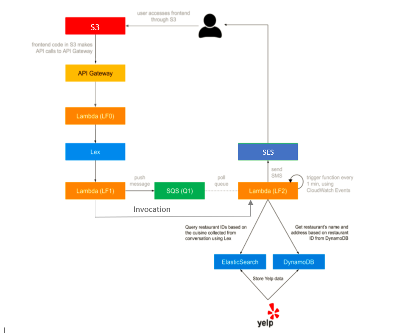
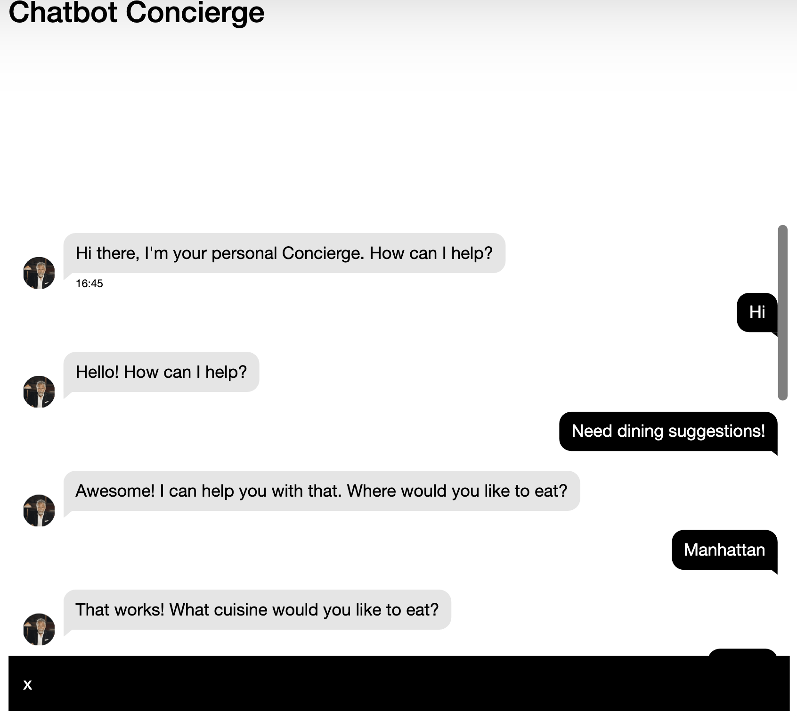
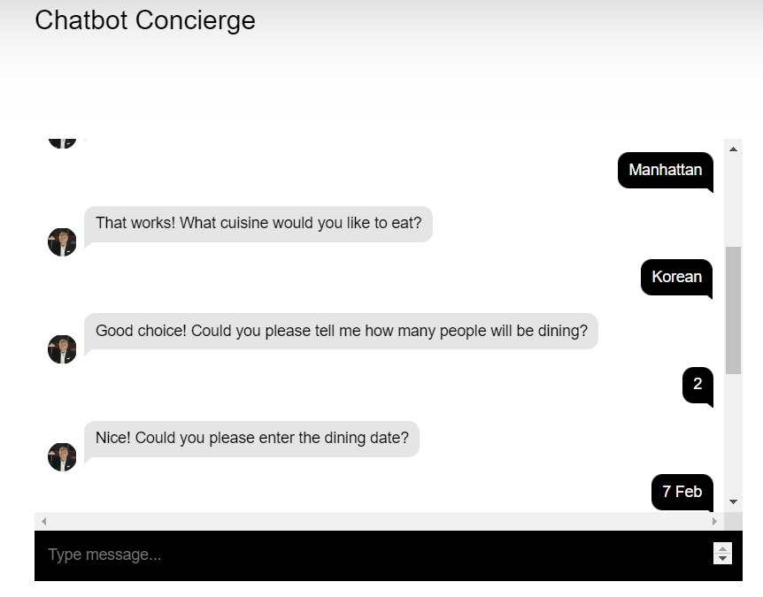
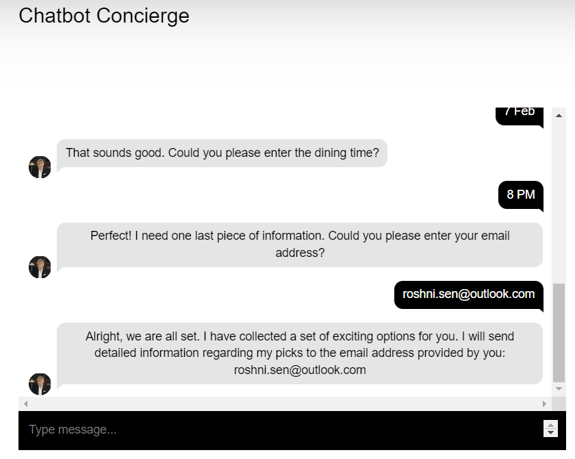
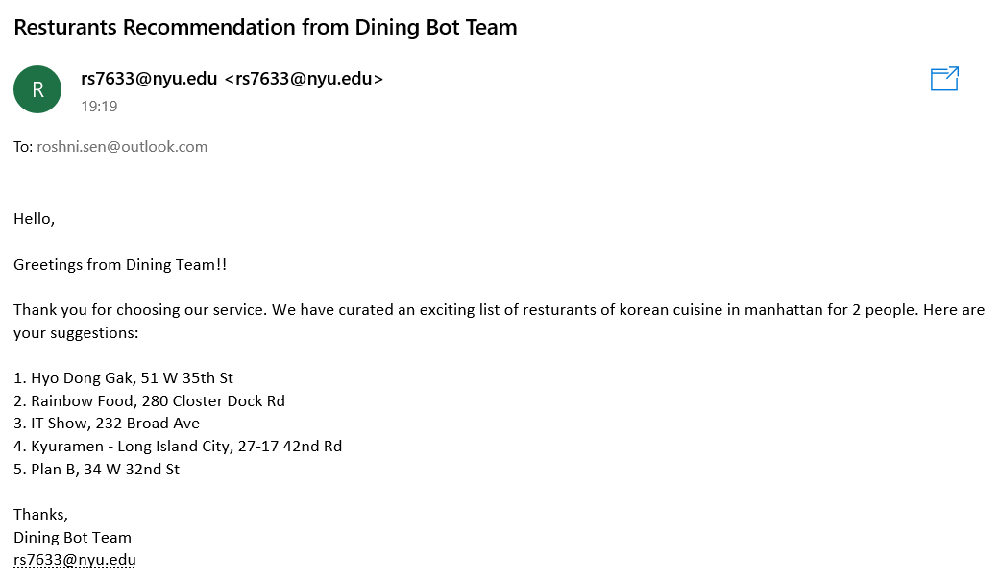

# NYU-Cloud-Dining-Concierge-Bot

## Components
### S3 Bucket
Used to deploy the front-end starter application to interface with the chatbot
### API Gateway
API Gateway handles all the tasks involved in accepting and processing up to hundreds of thousands of concurrent API calls, including traffic management, CORS support, authorization and access control,
### Amazon Lex (Version 1)
Amazon Lex is a web service that allows customers to include conversational interfaces for voice and text in the software applications they are developing.
### Lambda Function 0 (LF0)
Implemented LF0 to facilitate chat operation using request/response model (interfaces) specified in the API
### Lambda Function 1 (LF1)
Used LF1 as a code hook for Lex to manipulate and validate parameters as well as format the bot’s responses, which essentially entails the invocation of Lambda before Lex responds to any requests.
### Lambda Function 2 (LF2)
Developed LF2 to perform Open search on the data to get the top 5 results corresponding to the user's query and fetch the details from DynamoDB. The recommendations are sent to the users via email using Amazon SNS service.
### SQS
Used to collect the information provided by the user and to an SQS queue
### DynamoDB
Unstructed Database used to store the restaurant details scraped from Yelp
### Elastic Search/Open search
Used to store the indices and cuisines of the data
### SES
Used to notify the users with an email containing the top 10 restaurant recommendations

### Output Screenshots

 

